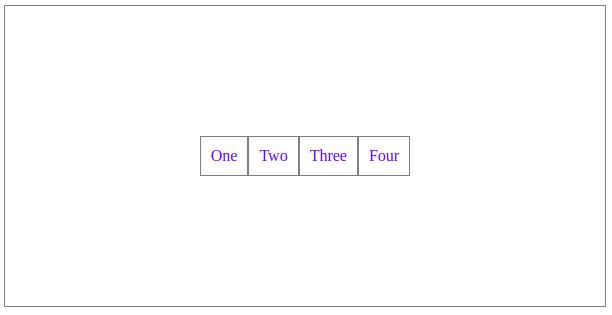
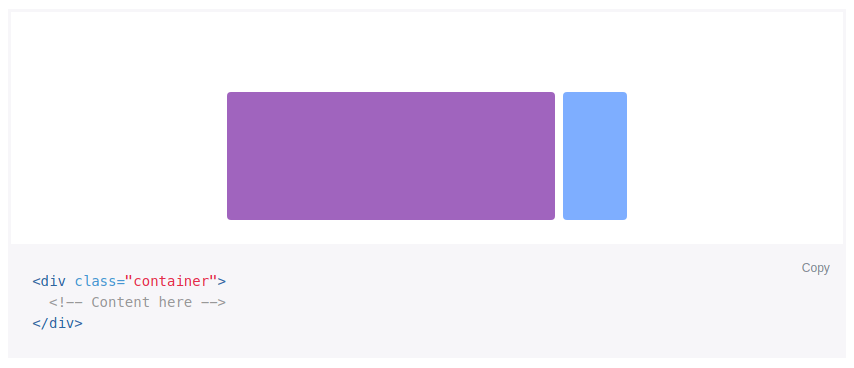
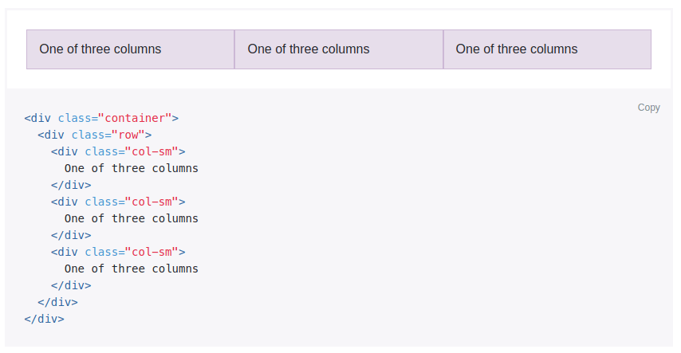
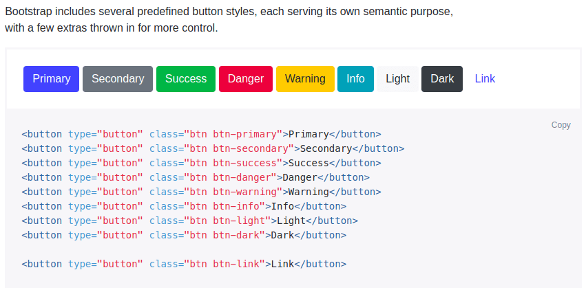
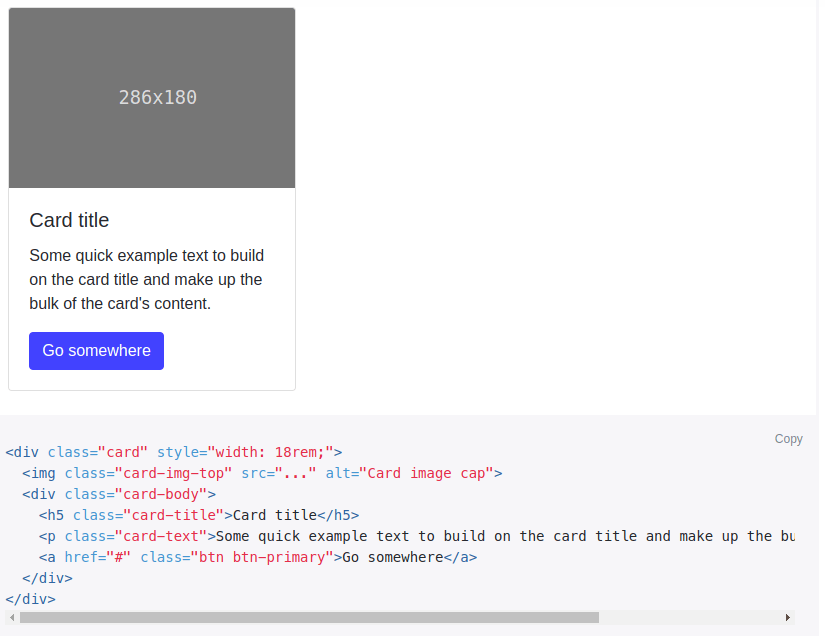
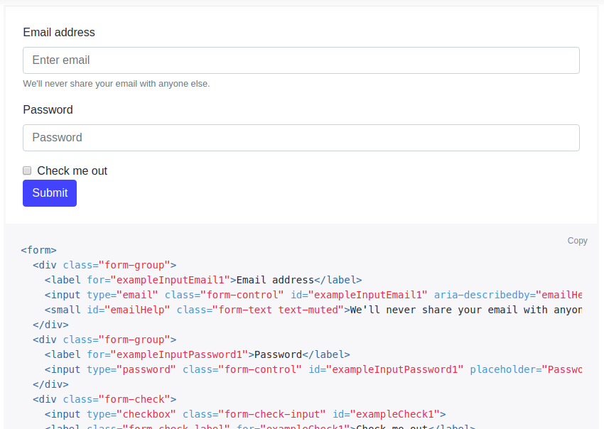
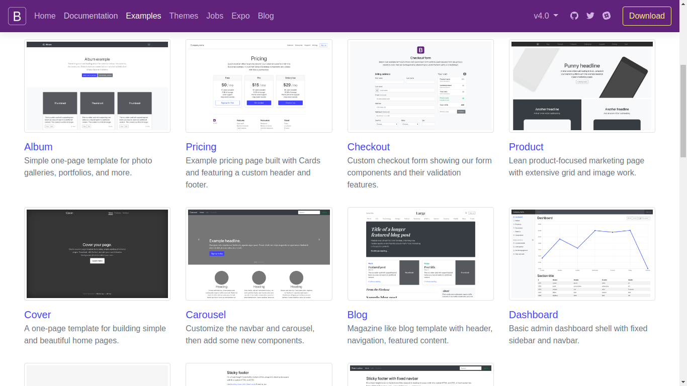

# CSS 2

---

## CSS Flexbox

In flexbox (`display: flex;`) layout system, there is a way to control other element positions. It's a more efficient way to lay out, align, and distribute space among items in a container. Even when their size is unknown and/or dynamic (thus the word "flex").

* `container`: parent element which can control their children/items positions
* `items`: children element/s which being controlled by their parent/container


CSS:

```css
.container {
  display: flex;
  justify-content: center;
  align-items: center;
}

.item {
  color: blue;
}
```

HTML:

```html
<section class="container">
  <div class="item">One</div>
  <div class="item">Two</div>
  <div class="item">Three</div>
  <div class="item">Four</div>
</section>
```

Result:



### `justify-content`

* `flex-start`: Items align to the left side of the container
* `flex-end`: Items align to the right side of the container
* `center`: Items align at the center of the container
* `space-between`: Items display with equal spacing between them
* `space-around`: Items display with equal spacing around them

### `align-items`

* `flex-start`: Items align to the top of the container
* `flex-end`: Items align to the bottom of the container
* `center`: Items align at the vertical center of the container
* `baseline`: Items display at the baseline of the container
* `stretch`: Items are stretched to fit the container

### `flex-direction`

* `row`: Items are placed the same as the text direction.
* `row-reverse`: Items are placed opposite to the text direction.
* `column`: Items are placed top to bottom.
* `column-reverse`: Items are placed bottom to top.

---

## CSS Library/Framework

[Bootstrap](https://getbootstrap.com), originally created by Twitter, is the most popular UI design framework that consists of best practices and predefined CSS classes.

It also includes a responsive grid system and various plugins.

To get started officially, visit their [Introduction page](https://getbootstrap.com/docs/4.0/getting-started/introduction).

Basically we can either use its CSS directly into our HTML, or download the library/framework first.

```html
<link rel="stylesheet" href="https://maxcdn.bootstrapcdn.com/bootstrap/4.0.0/css/bootstrap.min.css">
```

For now you don't need to include the JavaScript files.

Here's a starter template to start with.

```html
<!DOCTYPE html>
<html lang="en">

<head>
  <!-- Required meta tags -->
  <meta charset="UTF-8">
  <meta name="viewport" content="width=device-width, initial-scale=1, shrink-to-fit=no">

  <!-- Bootstrap CSS -->

  <link rel="stylesheet" href="https://maxcdn.bootstrapcdn.com/bootstrap/4.0.0/css/bootstrap.min.css">

  <title>Hello, world!</title>
</head>

<body>
  <div>
    <h1>Hello, world!</h1>
  </div>
</body>

</html>
```

Result:


With Bootstrap, there are several premade design ready for us to use.

### [Layout](https://getbootstrap.com/docs/4.0/layout/overview)

The grid layout system in Boostrap is using `container`, `row`, and `col` classes to layout and align content.



How it actually works is by using a combination of flexbox and CSS [`@media` query](https://www.w3schools.com/css/css_rwd_mediaqueries.asp), also fully
responsive.



### [Content](https://getbootstrap.com/docs/4.0/components)

Buttons:



Card:



Forms:



### Examples

There are even various examples we can use.



---

## CSS Animation

There's a simple animation library with just only CSS called [Animate.css](https://daneden.github.io/animate.css).

---

## References

* <https://css-tricks.com/snippets/css/a-guide-to-flexbox>
* <http://flexboxfroggy.com>
* <https://getbootstrap.com>
