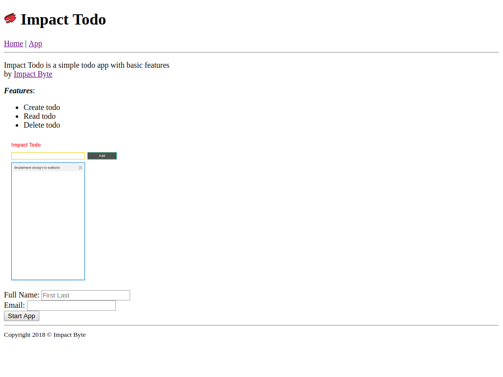
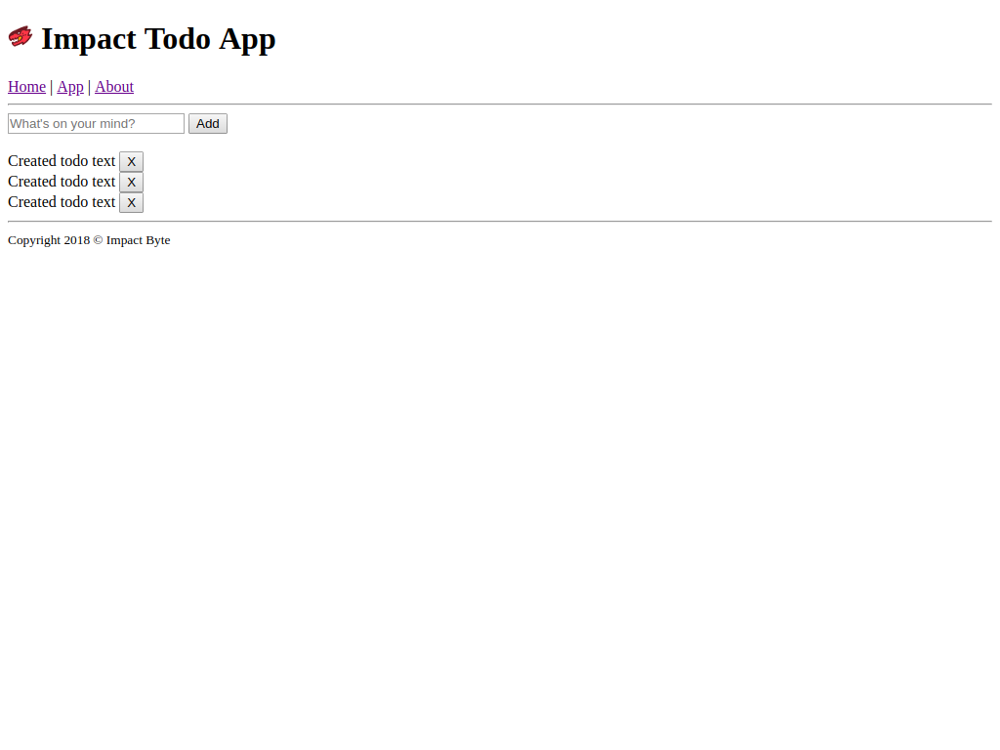

# HTML 1

---

## HTML (HyperText Markup Language)

HTML is the main building blocks of a website.

Usually have `.html` file extension.

It structures the content, but not the style or functionality.

That's why later we will need CSS and JavaScript.

### Tag

An HTML tag is declared like:

```
<tag>text</tag>
```

With the opening tag and closing tag, containing the text content.

### Elements

There are various HTML elements based on our intention or usage on the web page:

* For segmenting the web page: `doctype`, `html`, `head`, `body`
* For meta data: `title`, `meta`
* For text: `h1`-`h7`, `p`, `a`, `span`, `b`, `i`, `strong`, `em`
* For visualizing: `img`, `button`
* For dividing content: `div`, `main`, `section`, `article`, `aside`, `header`, `footer`, `nav`
* For listing things: `ul`, `ol`, `dl`, `li`
* For creating a table: `table`, `thead`, `tbody`, `tr`, `td`
* For multimedia: `video`, `audio`, `iframe`
* For form inputs: `form`, `label`, `input`, `fieldset`, `textarea`, `required`, `autofocus`, `contenteditable`
* For commenting: `<!-- comment -->`

You don't need to remember them all. Just use when you need it.

---

## Hello HTML

To create an HTML page, create an `index.html` or `hello.html` file in your editor. Then:

1.  Segment the page
2.  Fill with meta data
3.  Fill with content, text, or image

**Code:**

```html
<!DOCTYPE html> <!-- define the HTML version -->
<html> <!-- the actual HTML page -->

<!-- the head part, mostly containing metadata -->
<head>
  <title>Hello HTML</title>
</head> <!-- close the head part -->

<!-- the body part, containing the content -->
<body>
  <div>
    <!-- Header part -->
    <header>
      <h1>Hello HTML</h1>
    </header>

    <!-- Main content -->
    <main>
      <p>Hi, I'm coding with HTML.</p>
    </main>

    <!-- Footer part -->
    <footer>
      <small>Copyright 2018</small>
    </footer>
  </div>
</body> <!-- close the body part -->

</html> <!-- close the html page -->
```

Bear in mind of the placement of each elements after elements.

**Result:**


---

## HTML Style Guide

Keep in mind your usage of indentation, capitalization, white space; as they will help your code to be readable.

Visi [this Google's style guide](https://google.github.io/styleguide/htmlcssguide.html) as a reference.

---

## ID and Class in HTML Tags

Each HTML tag can be assigned with `id` or `class`.

`id` is unique, only use one `id` in a single tag.

`class` can be more than one, will be used for styling purpose.

`id` only:

```
<h1 id="title">
  Website Title
</h1>
```

`class` only:

```
<h1 class="blue">
  Website Title
</h1>
```

multiple `class`:

```
<h1 class="cool blue">
  Website Title
</h1>
```

combined:

```
<h1 id="title" class="cool blue">
  Website Title
</h1>
```

---
## Block Vs Inline Elements

* Block Elements: `<p>`, `<ul>`, `<ol>`, `<h1> - <h6>`, `<div>`, `<article>`
* Inline Elements:  `<1>`, `<em>`, `<strong>`

Block elements are meant to structure the main parts of your page, by dividing your content in coherent blocks.

Inline elements are meant to differentiate part of a text, to give it a particular function or meaning. Inline elements usually comprise a single or few words.

```
<article>
  <h1>Famous football quotes</h1>
  <p>
    Sir <strong>Alex Ferguson</strong> once said about Filipo Inzaghi:<q>That lad must have been born offside</q>.
  </p>
  <p>
    When criticized by John Carew, <strong>Zlatan Ibrahimovic</strong> replied: <q>What Carew does with a football, I can do with an orange</q>.
  </p>
  <p>
    <strong>George Best</strong> said <q>"I spent a lot of money on booze, birds and fast cars. The rest I just squandered."</q> when asked about his lifestyle.
  </p>
</article>
```
---
## HTML table

* Start with `<table>`
* Add rows with `<tr>`
* Add regular cells with `<td>` or heading cells with `<th>`

```
<table>
  <tr>
    <td>Row 1 - Col 1</td>
    <td>Row 1 - Col 2</td>
  </tr>
  <tr>
    <td>Row 2 - Col 1</td>
    <td>Row 2 - Col 2</td>
  </tr>
  <tr>
    <td>Row 3 - Col 1</td>
    <td>Row 3 - Col 2</td>
  </tr>
</table>
```

* Using `<thead>`, `<tfoot>` and `<tbody>`

```
<table>
  <thead>
    <tr>
      <th>thead1</th>
      <th>thead2</th>
    </tr>
  </thead>
  <tfoot>
    <tr>
      <th>tfoot1</th>
      <th>tfoot2</th>
    </tr>
  </tfoot>
  <tbody>
    <tr>
      <td>Row1-Col1</td>
      <td>Row1-Col2</td>
    </tr>
    <tr>
      <td>Row2-Col1</td>
      <td>Row2-Col2</td>
    </tr>
    <tr>
      <td>Row3-Col1</td>
      <td>Row3-Col2</td>
    </tr>
  </tbody>
</table>
```
---
## HTML forms

* Start with `<form>`
* Put all form controls tag inside `<form>` tag : `<input>`, `<label>`, `<button>`, `<option>`, `<select>`, `<textarea>`, etc ..

```
<form>
  <label for="email">email</label>
  <input id="email" type="email">

  <label for="password">Password</label>
  <input id="password" type="password" value="password">
</form>
```

* `<input>` tag type attributes : `type="text"`, `type="password"`, `type="email"`, `type="file"`, `type="number"`, `type="range"`, `type="url"`, etc ...

```
<input id="first_name" type="text" >
```
---
## File path

| Path                            | Description                                                                |
|---------------------------------|-:-:------------------------------------------------------------------------|
| ``         | picture.jpg is located in the same folder as the current page              |
| ``  | picture.jpg is located in the images folder in the current folder          |
| `` | picture.jpg is located in the images folder at the root of the current web |
| ``      | picture.jpg is located in the folder one level up from the current folder  |


---
## Complete Example

**Source Code:**

[`index.html`](./code/app/index.html)

**Screenshot:**



**Source Code:**

[`app.html`](./code/app/app.html)

**Screenshot:**



---

## References

* https://marksheet.io/html-basics.html
* https://learn.shayhowe.com/html-css/getting-to-know-htm
