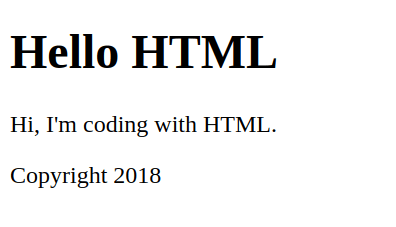

# HTML 1

---

## HTML (HyperText Markup Language)

HTML is the main building blocks of a website.

Usually have `.html` file extension.

It structures the content, but not the style or functionality.

That's why later we will need CSS and JavaScript.

### Elements

There are various HTML elements based on our intention or usage on the web page:

* For segmenting the web page: `doctype`, `html`, `head`, `body`
* For meta data: `title`, `meta`
* For text: `h1`-`h7`, `p`, `a`, `span`, `b`, `i`, `strong`, `em`
* For visualizing: `img`, `button`
* For dividing content: `div`, `main`, `section`, `article`, `aside`, `header`, `footer`, `nav`
* For listing things: `ul`, `ol`, `dl`, `li`
* For creating a table: `table`, `thead`, `tbody`, `tr`, `td`
* For multimedia: `video`, `audio`, `iframe`
* For form inputs: `form`, `label`, `input`, `fieldset`, `textarea`, `required`, `autofocus`, `contenteditable`

You don't need to remember them all. Just use when you need it.

---

## Hello HTML

To create an HTML page, create an `index.html` or `hello.html` file in your editor. Then:

1.  Segment the page
2.  Fill with meta data
3.  Fill with content, text, or image

**Code:**

```html
<!DOCTYPE html>
<html>

<head>
  <title>Hello HTML</title>
</head>

<body>
  <div>
    <header>
      <h1>Hello HTML</h1>
    </header>

    <main>
      <p>Hi, I'm coding with HTML.</p>
    </main>

    <footer>
      <small>Copyright 2018</small>
    </footer>
  </div>
</body>

</html>
```

Bear in mind of the placement of each elements after elements.

**Result:**



---

## HTML Style Guide

Keep in mind your usage of indentation, capitalization, white space; as they will help your code to be readable.

Visi [this Google's style guide](https://google.github.io/styleguide/htmlcssguide.html) as a reference.

---

## ID and Class in HTML Tags

Each HTML tag can be assigned with `id` or `class` like so:

`id` only:

```
<h1 id="title">
  Website Title
</h1>
```

`class` only:

```
<h1 class="black">
  Website Title
</h1>
```

combined:

```
<h1 id="title" class="black">
  Website Title
</h1>
```
