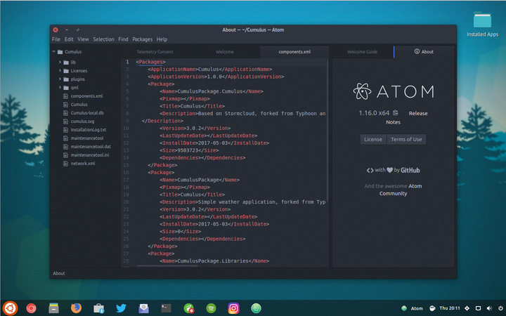

# Setup 2

---

## Web Browser

It's best to use [Google Chrome](https://google.com/chrome) throughout our class. As a lot of better developer tools are only available in Chrome.

We will use some helpful browser extensions like:

* [Adblock Pro](https://chrome.google.com/webstore/detail/adblock-pro/ocifcklkibdehekfnmflempfgjhbedch): to block ads, obviously
* [Markdown Preview Plus](https://chrome.google.com/webstore/detail/markdown-preview-plus/febilkbfcbhebfnokafefeacimjdckgl): to read markdown file in the browser

---

## Code Editor

We can use two kinds of editor.

For offline or local use, we recommend [Atom](https://atom.io)

For online, we recommend [Codepen](https://codepen.io)

Atom features helpful actions like:

* command palette: press `ctrl+shift+p` on Linux or `cmd+shift+p` on Mac to activate the ultimate command palette window
* split view: drag another window to the other side (horizontal or vertical) of current window

There are even some helpful packages too:

* `beautify`: automatically beautify our code syntax
* `file-icons`: give the sidebar cooler icons
