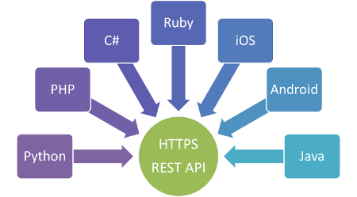

# Part 16

---

* ▢ HTTP API & Protocol
  * HTTP/HTTPS
  * HTTP Request and Response
  * TCP/IP, OSI layer, network address
  * SSL/TLS: Let's Encrypt
* ▢ REST APIs
  * `GET`, `POST`, `PUT`, `DELETE`
  * AJAX/Fetch requests
  * REST vs SOAP vs GraphQL vs gRPC
* ▢ Web Services
  * Mailchimp, Google Forms
  * Twitter, Facebook, Instagram, Wikipedia
  * Google Maps
  * Trello, Slack
* ▢ REST API Client
  * cURL or HTTPie
  * Postman or Insomnia
* ▢ Internet Trivia
  * FTP, telnet
  * Real-time protocols: WebSocket, WebRTC, Socket.io

---

## Restful APIs

### What is an API

Application Programming Interface (API) is a term for describing how a programs communicate and exchange data in certain format.

### What is REST

REpresentational State Transfer (REST) is a one of many archajax javascriptitectural style of an API. A RESTful API is an application program interface (API) that uses HTTP requests (HTTP verbs) to GET, PUT, POST and DELETE data.



### HTTP verbs

HTTP defines a set of request methods to indicate the desired action to be performed for a given resource.

| HTTP Verb | Description                                                                                                                          |
| --------- | ------------------------------------------------------------------------------------------------------------------------------------ |
| GET       | The GET method requests a representation of the specified resource. Requests using GET should only retrieve data.                    |
| POST      | The POST method is used to submit an entity to the specified resource, often causing a change in state or side effects on the server |
| PUT       | The PUT method replaces all current representations of the target resource with the request payload.                                 |
| DELETE    | The DELETE method deletes the specified resource.                                                                                    |
| CONNECT   | The CONNECT method establishes a tunnel to the server identified by the target resource.                                             |
| OPTIONS   | The OPTIONS method is used to describe the communication options for the target resource.                                            |
| HEAD      | The HEAD method asks for a response identical to that of a GET request, but without the response body.                               |

### HTTP header

HTTP headers allow the client and the server to pass additional information with the request or the response. A request header consists of its case-insensitive name followed by a colon ':', then by its value (without line breaks). You can see it through you browser by using developer tools (Network tab).


### Example of RESTful API designs

| Route                     | HTTP Verb | Description                  |
| ------------------------- | --------- | ---------------------------- |
| example.com/api/items     | GET       | Get all the items            |
| example.com/api/items/:id | GET       | Get a single item            |
| example.com/api/items     | POST      | Save an item                 |
| example.com/api/items     | DELETE    | Remove all the items         |
| example.com/api/items/:id | DELETE    | Remove an item               |
| example.com/api/items/:id | PUT       | Update an item with new info |

## Example of Github RESTful API

| Route                                                 | HTTP Verb | Description             |
| ----------------------------------------------------- | --------- | ----------------------- |
| https://api.github.com/users                          | GET       | Get all users (limited) |
| https://api.github.com/users/muhammadhaekal           | GET       | Get a single user       |
| https://api.github.com/users/muhammadhaekal/followers | GET       | Get user followers      |
| https://api.github.com/users/muhammadhaekal/following | GET       | Get following users     |

## Fetching data from API

The `fetch()` API provides a JavaScript interface for accessing and manipulating parts of the HTTP pipeline, such as requests and responses.

A request to api will return as a javascript response object. We can use `.json()` built in method to returns a promise that resolves with the result of parsing the body text as JSON.

example:

```js
fetch("https://api.github.com/users/muhammadhaekal")
  .then(response => {
    return response.json();
  })
  .then(data => {
    console.log(data);
  });
```

## API Project 1

[ExpectedOutput](./assets/API-project-1.png)

## References

https://scotch.io/tutorials/how-to-use-the-javascript-fetch-api-to-get-data
https://developer.mozilla.org/en-US/docs/Web/API/Fetch_API/Using_Fetch
