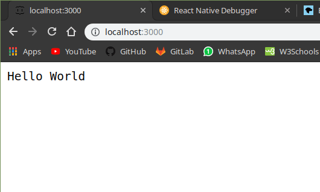

# Express.js 1

---

- ▢ Node.js, Browser, & REST API
  - `fetch`, `axios`
  - `phantomjs`, `puppeteer`
- ▢ Transpilation
  - Babel, `babelrc`
- ▢ Node.js Trivia
  - File Input/Output (I/O): `readline`, `readfile`
  - Desktop app: Electron
- ▢ Node.js Library/Framework
  - Express.js
  - vs Hapi, Loopback
  - vs Python & Django
  - vs Ruby & Rails
  - vs PHP & Laravel/CodeIgniter
  - vs Java & Spring
- ▢ Express Essentials
  - IP address and port
  - Ignore templating engine
- ▢ Express Routing
  - `.get`, `.post`, `.delete`, `.put`
- ▢ Express Data
  - `body`, `params`, `query`
- ▢ Express Plugin/Middleware

## Modules

- [JS Node 101](http://bit.ly/js-node-101)
- [`module-nodejs`](https://github.com/impactbyte-learn/module-nodejs)
- [`module-expressjs`](https://github.com/impactbyte-learn/module-expressjs)

---

# Node.js, Browser, & REST API

- `fetch`
- `axios`
- `phantomjs`
- `puppeteer`

## References

- [`node-fetch`](https://npm.im/node-fetch)
- [`axios`](https://npm.im/axios)
- [PhantomJS](http://phantomjs.org)
- [Google Puppeteer](https://developers.google.com/web/tools/puppeteer)

---

# Transpilation

- Babel
- `babelrc`

## References

- [Babel · The compiler for writing next generation JavaScript](https://babeljs.io)
- [`.babelrc`](https://babeljs.io/docs/usage/babelrc)
- [Official Babel Presets Plugin](https://babeljs.io/docs/plugins/#official-presets)

---

# Node.js Trivia

## File Input/Output (I/O)

- `readline`
- `readfile`

## References

- [Readline](https://nodejs.org/api/readline.html)
- [File System (`fs`)](https://nodejs.org/api/fs.html)

---

# Node.js Library/Framework

- Express.js
- vs Hapi, Loopback
- vs Python & Django
- vs Ruby & Rails
- vs PHP & Laravel/CodeIgniter
- vs Java & Spring

## References

### JavaScript

- [Express - Node.js web application framework](https://expressjs.com)
- [Feathers | Instant Realtime and REST APIs for Node.js](https://feathersjs.com)
- [Sails.js | Realtime MVC Framework for Node.js](https://sailsjs.com)
- [hapi.js - A rich framework for building applications and services](https://hapijs.com)
- [LoopBack - Node.js framework](http://loopback.io)
- [AdonisJs - Node.js web framework](https://adonisjs.com)

### Python

- [Python.org](https://www.python.org)
- [Django | The Web framework for perfectionists with deadlines](https://www.djangoproject.com)

### Ruby

- [Ruby Programming Language](https://www.ruby-lang.org/en)
- [Ruby on Rails | A web-application framework that includes everything needed to create database-backed web applications according to the Model-View-Controller (MVC) pattern.](http://rubyonrails.org)

### PHP & Laravel/CodeIgniter

- [PHP: Hypertext Preprocessor](http://php.net)
- [Laravel - The PHP Framework For Web Artisans](https://laravel.com/)

### Java & Spring

- [Java](https://java.com/en)
- [Spring](https://spring.io)

### Go

- [The Go Programming Language | golang.org | Open source programming language that makes it easy to build simple, reliable, and efficient software](https://golang.org)
- [`http`](https://golang.org/pkg/net/http)
- [Echo - High performance, minimalist Go web framework](https://echo.labstack.com/)

---

# Express Essentials

- IP address and port
- Ignore templating engine

## References

- [Express "Hello World" example](https://expressjs.com/en/starter/hello-world.html)
- [Using template engines with Express](https://expressjs.com/en/guide/using-template-engines.html)

---

# Express Routing

- `app` / `route`
  - `.get`
  - `.post`
  - `.delete`
  - `.put`

## References

- [Express routing](https://expressjs.com/en/guide/routing.html)

---

# Express Data

- `req` / `res`
  - `.body`
  - `.params`
  - `.query`
  - `.header` / `.get`

## References

- [Express 4.x - API Reference](https://expressjs.com/en/api.html)

---

# Express Plugin/Middleware

An Express application can use the following types of middleware:

- Application-level middleware
- Router-level middleware
- Error-handling middleware
- Built-in middleware
- Third-party middleware

# Express Cheatsheet

### Getting started

```sh
npm init
npm install --save express # Install express
```

### Express Structure

```js
// Require express package
const express = require("express")

// Initialize express
const app = express()

// Create our first route
app.get("/", (req, res) => {
  res.send("Hello World") // Send `Hello World` to client
})

// Start server at port 3000
app.listen(3000)
```

result:



### Multiple routes

```js
const express = require("express")

const app = express()

// Handle GET / request
app.get("/", (req, res) => {
  res.send("My API")
})

// Handle GET /profile request
app.get("/profile", (req, res) => {
  // Send JSON object
  res.send({
    name: "John Doe",
    email: "text@gmail.com"
  })
})

app.listen(3000)
```

result:


---

# References

- [Using Express middleware](https://expressjs.com/en/guide/using-middleware.html)
- [`body-parser`](https://npm.im/body-parser)
- [`cookie-parser`](https://npm.im/cookie-parser)
- [`helmet`](https://npm.im/helmet)
- [`cors`](https://npm.im/cors)
- [Passport.js](http://www.passportjs.org)

---

# Node.js Desktop app

- NW.js
- Electron

## References

- [NW.js](https://nwjs.io)
- [Electron - Build cross platform desktop apps with JavaScript, HTML, and CSS](https://electronjs.org)

---

# API Project 2

- [API Project 2](../api-project-2/README.md)
