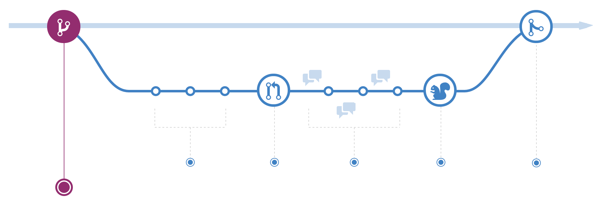

# GitHub 2

## Collaboration: pull/merge request

Merge request(GitLab) or pull requests (GitHub) are created in a git management application and ask an assigned person to merge two branches. In GitHub, collaboration is often done by these flows that involve pull request.

Pull requests let you tell others about changes you've pushed to a repository on GitHub. Once a pull request is opened, you can discuss and review the potential changes with collaborators and add follow-up commits before the changes are merged into the repository.

## Creating pull request (Github)

There are 2 main work flows when dealing with pull requests:

1.  Pull request from branch within a repository.
1.  Pull request from a forked repository.

## Pull request from branch within a repository

[](https://guides.github.com/introduction/flow)

### Step by Step

* Clone the repo, then create a `branch`

```
git checkout -b pull-request-demo
```

* Add commits to that created `branch`

```
git add
git commit -m "[commit message]"
```

* Push the `branch` from `local` to `remote`

```
git push origin pull-request-demo
```

* Open a pull request, from that `branch` to `master`

  * To the right of the Branch menu, click New pull request.

    

  * Use the base branch dropdown menu to select the branch you'd like to merge your changes into, then use the compare branch drop-down menu to choose the topic branch you made your changes in.

    

  * Type a title and description for your pull request.

    

  * Click Create pull request.

    

* Discuss and review your code with peers

* Deploy the `branch` for testing purpose

* Merge the `branch` into `master`

## Pull request from a forked repository.

[](https://guides.github.com/activities/forking)

Forking is process where your contribute to someone else’s project or use someone’s project as the starting point for your own. Forking a repository allows you to freely experiment with changes without affecting the original project. The fork itself is a copy of a repository.

Remember that this _fork_ terminology is mostly happen inside Git platforms like GitHub, GitLab, or Bitbucket.

### Step by step

* Fork a repository, then clone the repo

```
git clone https://github.com/<your-username>/<repo>.git
cd <repo>
git remote add upstream https://github.com/<source>/<repo>.git
```

* Add commits to that the `master` branch of forked repository

```
git add
git commit -m "[commit message]"
```

* Push the changes from `local` to `remote`

```
git push origin master
```

* Open a pull request, from forked `master` to original `master`

  * Go to GitHub original source repo (not forked repo), click New pull request.

    

  * Confirm that the base fork is the repository you'd like to merge changes into. Use the base branch drop-down menu to select the branch of the upstream repository you'd like to merge changes into.

  * Use the head fork drop-down menu to select your fork, then use the compare branch drop-down menu to select the branch you made your changes in.

    

  * Type a title and description for your pull request.

    

  * Click Create pull request.

    

* Discuss and review your code with peers
* Deploy the fork for testing purpose
* Merge the fork into the original repo

Keep in mind that in this way, you will have at least two remotes. The fork is now the `origin`, and the original is the `upstream`.

```sh
$ git remote -v

origin    https://github.com/YOUR_USERNAME/YOUR_FORK.git (fetch)
origin    https://github.com/YOUR_USERNAME/YOUR_FORK.git (push)
upstream  https://github.com/ORIGINAL_OWNER/ORIGINAL_REPOSITORY.git (fetch)
upstream  https://github.com/ORIGINAL_OWNER/ORIGINAL_REPOSITORY.git (push)
```

---

## References

* [Understanding the GitHub Flow - GitHub Guides](https://guides.github.com/introduction/flow)
* [About pull requests - GitHub User Documentation](https://help.github.com/articles/about-pull-requests)
* [Forking Projects - GitHub Guides](https://guides.github.com/activities/forking)
* [Fork A Repo - GitHub User Documentation](https://help.github.com/articles/fork-a-repo)
