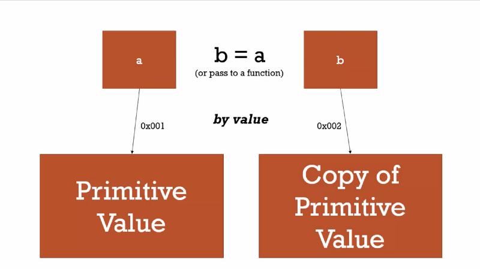
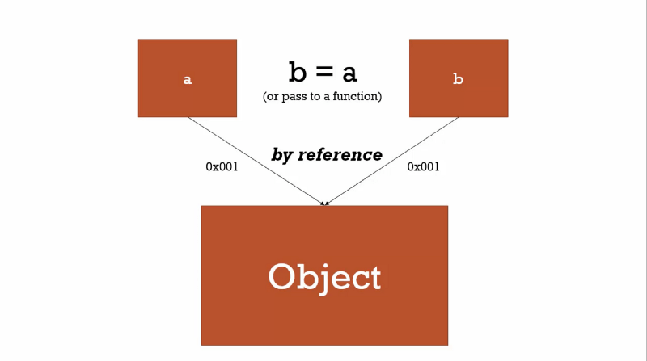

# JavaScript 9

---

## Strict mode: `use strict`

"use strict"; Defines that JavaScript code should be executed in "strict mode".
After use strict code is executed, you can not :

Using a variable, without declaring it.
```js
"use strict";
x = 3.14;  

```

Deleting variable/object/function, without declaring it.
```js
var x = 3.14;
delete x; 
```

Duplicating parameter.
```js
"use strict";
function x(p1, p1) {}; 
```

Declaring Numeric literal variable.
```js
"use strict";
var x = 010;
```

If you declare use strict inside a function, only the code inside the function is in strict mode.
```js
x = 3.14;       // This will not cause an error. 
myFunction();

function myFunction() {
   "use strict";
    y = 3.14;   // This will cause an error
}
```

Using reserved keyword for future JavaScript version.

* implements
* interface
* let
* package
* private
* protected
* public
* static
* yield

---

## scope & `this` keyword

### In JavaScript there are two types of scope:

* Local scope
* Global scope

Local scope example:
```js
// code here can NOT use carName

function myFunction() {
    var carName = "Volvo";

    // code here CAN use carName

}
```


Global scole example:
```js
var carName = "Volvo";

// code here can use carName

function myFunction() {

    // code here can also use carName 

}
```

If you assign a value to a variable that has not been declared, it will automatically become a GLOBAL variable:
```js
myFunction();

// code here can use carName 

function myFunction() {
    carName = "Volvo";
}
```

### This keyword in JavaScript

In a function definition, this refers to the "owner" of the function.


If we run this code inside browser, this refer to window Object.

```js
function myFunction() {
    return this;
}
```

In this example this refer to a person object.

```js
var person = {
    firstName: "John",
    lastName : "Doe",
    id       : 5566,
    fullName : function() {
        return this.firstName + " " + this.lastName;
    }
};
```

### Function Bindung Using call() and apply()

The call() and apply() methods are predefined JavaScript methods.
They can both be used to call an object method with another object as argument.

```js
var person1 = {
    fullName: function() {
        return this.firstName + " " + this.lastName;
    }
}
var person2 = {
    firstName:"John",
    lastName: "Doe",
}
person1.fullName.call(person2); 
```

### Object Bindung Using bind()

```js
var person1 = {
    fullName: function() {
        return this.firstName + " " + this.lastName;
    }
}
var person2 = {
    firstName:"John",
    lastName: "Doe",
}

person1.bind(person2)
var x = person1.fullName(); 
```

---

## Pass by value and reference

Pass by value copies the value into two separate spots in memory effectively making them entirely separate entities despite one initially being set equal to the other.



Pass by value example: 
```js
let a = 5 
let b = a

console.log(a) // => 5
console.log(b) // => 5

a = 1

console.log(a) // => 1
console.log(b) // => 5
```

All objects interact by reference in Javascript so when setting equal to each other or passing to a function they all point to the same location so when you change one object you change them all.




```js

let a = {language: "Javascript"}
let b = a

console.log(a) // => {language: "Javascript"}
console.log(b) => {language: "Javascript"}

a.language = "Ruby"

console.log(a) // => {language: "Ruby"}
console.log(b) // => {language: "Ruby"}
```

## Object Constructor

Sometimes we need a "blueprint" for creating many objects of the same "type".
The way to create an "object type", is to use an object constructor function.

```js
function Person(first, last, age, eyecolor) {
    this.firstName = first;
    this.lastName = last;
    this.age = age;
    this.eyeColor = eyecolor;
}
var myFather = new Person("John", "Doe", 50, "blue");
var myMother = new Person("Sally", "Rally", 48, "green");
```

<!-- All JavaScript objects inherit properties and methods from a prototype. -->


<!-- * Exception and error handling: `try catch`, `.then`/`.catch` -->
