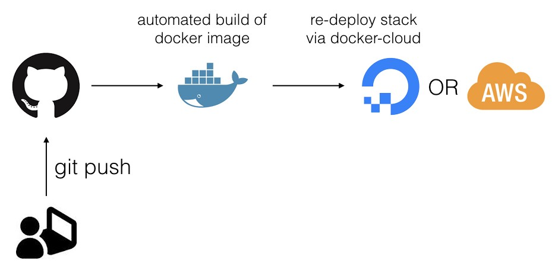

# JavaScript Auth 1

---

# JavaScript & REST API

- CORS (Cross-Origin Resource Sharing (CORS)

# Node.js Trivia

- Documentaion/Generators: Swagger, API Blueprint, Stoplight

---

# JavaScript & REST API

- Cross-Origin Resource Sharing (CORS)

## References

- [Cross-Origin Resource Sharing (CORS) - HTTP | MDN](https://developer.mozilla.org/en-US/docs/Web/HTTP/CORS)
- [enable cross-origin resource sharing](https://enable-cors.org)
- [Understanding CORS](https://spring.io/understanding/CORS)
- [`cors`](https://npm.im/cors)

---

## References

- [HTTP authentication - HTTP | MDN](https://developer.mozilla.org/en-US/docs/Web/HTTP/Authentication)
- [JSON Web Tokens - jwt.io](https://jwt.io)
- [Auth0 - Single Sign On & Token Based Authentication](https://auth0.com)
  - [Auth0 JavaScript SDK Quickstarts](https://auth0.com/docs/quickstart/spa/vanillajs)
  - [Auth0 React SDK Quickstarts](https://auth0.com/docs/quickstart/spa/react)
- [Passport.js - Simple, unobtrusive authentication for Node.js](http://www.passportjs.org)
- GitHub
  - [Basics of Authentication | GitHub Developer Guide](https://developer.github.com/v3/guides/basics-of-authentication/)
  - [Building OAuth Apps | GitHub Developer Guide](https://developer.github.com/apps/building-oauth-apps/)
- [Facebook Login for the Web with the JavaScript SDK](https://developers.facebook.com/docs/facebook-login/web)
- [Oauth with the Twitter API — Twitter Developers](https://developer.twitter.com/en/docs/basics/authentication/overview/oauth)
- [Using OAuth 2.0 to Access Google APIs  |  Google Identity Platform  |  Google Developers](https://developers.google.com/identity/protocols/OAuth2)

---

# Node.js Deployment



There are several approach to deploy your Node.js app. If, your app just for learning purpose, You may want do deploy it to **Heroku / Now.sh**. Heroku / Now.sh is **Platform as a service**, to deploy your web app easily. But, if your app is production ready, that's a different story. You need to use **Docker & Nginx** and deploy it to **DigitalOcean** or **AWS**.

- PaaS: Heroku, Now.sh
- IaaS/VPS: Digital Ocean, Amazon Lightsail, Linode
- Server: Nginx, Apache
- Process management: `pm2`
- Cloud Services: Amazon Web Services, Google Cloud Platform, Microsoft Azure
- Container: Docker

## References

- [Cloud Application Platform | Heroku](https://www.heroku.com)
- [Now – Realtime Global Deployments](https://zeit.co/now)
- [DigitalOcean | SSD Cloud Server, VPS Server, Simple Cloud Hosting](https://www.digitalocean.com)
- [Lightsail - Amazon AWS](https://aws.amazon.com/lightsail)
- [nginx](http://nginx.org)
- [PM2 - Advanced Node.js process manager](http://pm2.keymetrics.io)
- [Amazon Web Services (AWS) - Cloud Computing Services](https://aws.amazon.com)
- [Google Cloud Platform | Google Cloud Computing, Hosting Services & Cloud Support](https://cloud.google.com)
- [Microsoft Azure Cloud Computing Platform & Services](https://azure.microsoft.com/en-us)
- [Docker - Build, Ship, and Run Any App, Anywhere](https://www.docker.com)

---

# Node.js Trivia

API Documentaion and Generators

- Swagger
- API Blueprint
- Stoplight

## References

- [World's Most Popular API Framework | Swagger](https://swagger.io)
- [API Blueprint | API Documentation with powerful tooling](https://apiblueprint.org)
- [StopLight - The Modular API Toolkit](https://stoplight.io)

---

# Authentication / Authorization


Authentication is a mechanism to recognize the user`s identity. Authorization determines whether you are authorized to access the resources. There are so many authentication mechanisms such as:

- Basic password
- JSON Web Token (JWT)
- Auth0
- Passport
- Social OAuth
  - GitHub
  - Facebook
  - Twitter
  - Google
- Passwordless
  - Email
  - SMS
  - Voice

# JSON Web Token (JWT)

- **Hashing** : Hashing is the application of a function to a variable sized input to produce a constant sized output. A hash is also a one-way function which means that there isn't a function to reverse or undo a hash.
- **Salting** : Add random data to the input of a hashing function that makes each password hash unique.
- **Bcrypt** : Bcrypt is an adaptive hash function that using **a work factor** (also known as security factor), which allows you to determine how expensive the hash function will be.


### What does a JWT _Look_ Like?

Tokens are a string of "url safe" characters which _encode_ information.
Tokens have **three components** (separated by periods)
(shown here on multiple lines for _readability_ but used as a single string of text)

```js
eyJ0eXAiOiJKV1QiLCJhbGciOiJIUzI1NiJ9           // header
.eyJrZXkiOiJ2YWwiLCJpYXQiOjE0MjI2MDU0NDV9      // payload
.eUiabuiKv-8PYk2AkGY4Fb5KMZeorYBLw261JPQD5lM   // signature
```

#### 1. Header

The first part of a JWT is an encoded string representation
of a simple JavaScript object which describes the token along with the hashing algorithm used.

#### 2. Payload

The second part of the JWT forms the core of the token.
Payload length is proportional to the amount of data you store in the JWT.
General rule of thumb is: store the bare minimum in the JWT.

#### 3. Signature

The third, and final, part of the JWT is a signature generated
based on the header (part one) and the body (part two) and will be used
to _verify_ that the JWT is valid.

### What are "Claims"?

Claims are the predefined **keys** and their **values**:

- **iss**: issuer of the token
- **exp**: the expiration timestamp (reject tokens which have expired). Note: as defined in the spec, this must be in seconds.
- **iat**: The time the JWT was issued. Can be used to determine the age of the JWT
- **nbf**: "not before" is a future time when the token will become active.
- **jti**: unique identifier for the JWT. Used to prevent the JWT from being re-used or replayed.
- **sub**: subject of the token (rarely used)
- **aud**: audience of the token (also rarely used)

# Auth Project 1

- [Auth Project 1](../auth-project-1/README.md)
