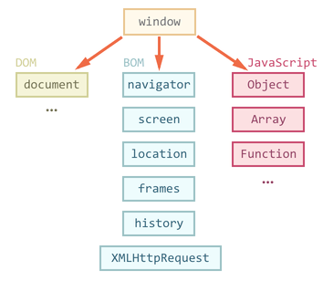
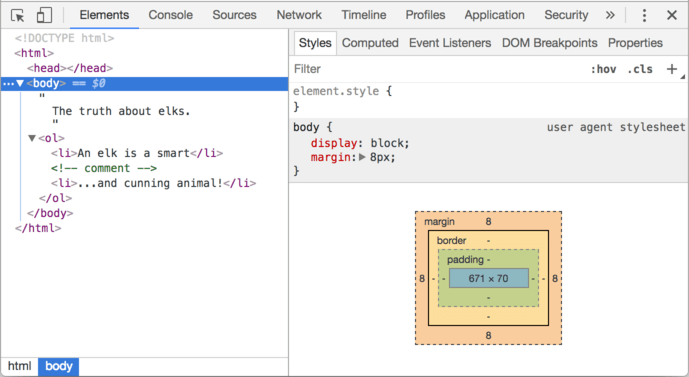
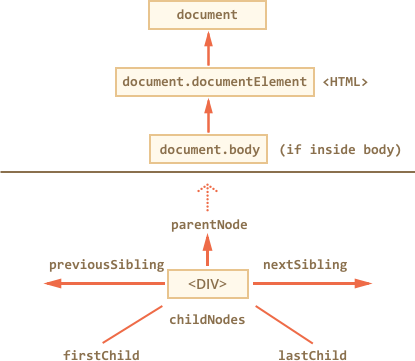
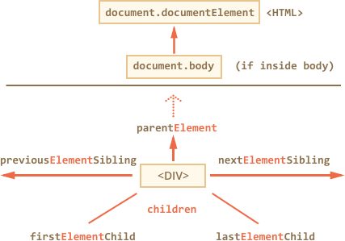

# JavaScript DOM 1

---

## Document Object Model (DOM)

> In short, DOM is a way to connect between HTML and JavaScript.
> So yes, you need DOM in order to access HTML via JavaScript.

The DOM is a programming interface for HTML, XHTML, and XML (Extensible Markup Language) documents.

It is a cross-platform and language-independent convention for representing and interacting with objects in the web page.

It represents the page so that programs can change the document structure, style, and content.

The DOM represents the document as _nodes_ and _objects_. That way, programming languages like JavaScript can connect to the page.

The nodes of every document are organized in a tree structure, called the DOM tree. Objects in the DOM tree may be addressed and manipulated by using methods on the objects. The public interface of a DOM is specified in its application programming interface (API).

Commonly used when accessing `window` or `document` object.

---

## Browser Object Model (BOM)

The BOM is a browser-specific convention referring to all the objects exposed by the web browser. Unlike the Document Object Model, there is no standard for implementation and no strict definition, so browser vendors are free to implement the BOM in any way they wish.

BOM consists of the objects like `navigator`, `history`, `screen`, `location`, etc which are children of `window`. BOM features actually overlaps with DOM and contains the DOM. Because BOM doesn't have any standard, any browser can implement it as they like.

Sometimes called [Browser API](https://developer.mozilla.org/en-US/docs/Web/API/Using_the_Browser_API).

---

## Representation

For example, these are the representation of the HTML:

```html
<!doctype html>
<html>
  <head>
    <title>My home page</title>
  </head>
  <body>
    <h1>My home page</h1>
    <p>Hello, I am Marijn and this is my home page.</p>
    <p>I also wrote a book! Read it
      <a href="http://eloquentjavascript.net">here</a>.</p>
  </body>
</html>
```

The page structure:


The DOM tree:


While the relationship or links between those nodes:


---

## DOM objects

There are various objects that already provided by default via DOM.

### `window` object



The DOM is actually inside the `window` object.

It represents the browser window.

Through `window`, we can interact with DOM and JavaScript.

We can retrieve the height and width of the current window by accessing its properties. Even our current scroll position.

```js
window.innerHeight;
// 800

window.innerWidth;
// 900

window.scrollY;
// 200

window.scrollX;
// 0
```

It's useful to retrieve the URL or path as well.

```js
window.origin;
// "http://example.com"

window.location.origin;
// "http://example.com"

window.location.href;
// "http://example.com/path/to/page"

window.location.pathname;
// "/path/to/page"
```

The `alert` and `prompt` functions are actually inside `window` too.

```js
window.alert("Alert");

window.prompt("Input");
```

Since `window` is the top-level object in the browser, you can access all its properties and methods directly.

### `document` object and DOM nodes

The real DOM.

The standard itself is being develop in two working groups:

* [W3C](http://www.w3.org), publishing at https://www.w3.org/TR/dom
* [WhatWG](https://whatwg.org), publishing at https://dom.spec.whatwg.org

We can retrieve the `body` inside a web `document`:

```js
document.body;

// <body>...</body>
```

When we're using Dev Tools, we're actually inspecting the DOM tree nodes, living inside the HTML document.



Therefore, and HTML document is represented inside the browser as the DOM tree.

* Tags become element nodes and form the structure
* Text becomes text nodes
* and everything in HTML has its place in DOM, even comments

---

## DOM node traversing

Traversing or walking through the DOM nodes is a way to get into the node we are targeting. After obtaining its navigational properties, later we can modify or manipulate it.



* `<html>` = `document.documentElement`
* `<body>` = `document.body`
* `<head>` = `document.head`

Each nodes/elements which have other nodes/elements, so called children, can access their `children`, `childNodes`, `firstChild`, `lastChild`

Therefore it's also possible to obtain their siblings (next/previous) and the parent of the element.



```js
document.body.children;
```

Remember that not all nodes are elements, but all elements are nodes.

There are two main sets of navigational properties:

* For all nodes: `parentNode`, `childNodes`, `firstChild`, `lastChild`, `previousSibling`, `nextSibling`.
* For element nodes only: `parentElement`, `children`, `firstElementChild`, `lastElementChild`, `previousElementSibling`, `nextElementSibling`.

---

## DOM node selection

```html
<div id="element" class="container black">
  <div id="element-content" class="item black">Element</div>
</div>
```

`getElementById`

```js
document.getElementById("element");
// return single element
```

`getElementsByName`

```js
document.getElementByName("name");
// return single element with matched name attribute
// but won't return anything if there isn't any
```

`getElementsByTagName`

```js
document.getElementsByTagName("div");
// return array of div elements
```

`getElementsByClass`

```js
document.getElementsByClass("black");
// return array of elements with class black
```

`querySelectorAll`

```js
document.querySelectorAll(".black");
// return array of elements with class black
```

`querySelector`

```js
document.querySelector("#element");
// return the first element found with id element
```

---

## DOM node manipulation

```js
document.body.innerHTML;
// get the content of body

document.body.innerHTML += "<h1>Content Replace</h1>";
// replace or fully overwrite the content of body with new element

document.body.outerHTML;
// get the content of body, with body itself
```

We can retrieve various values with other properties too.

* `nodeValue`/`data`: The content of a non-element node (text, comment). These two are almost the same, usually we use data. Can modify.
* `textContent`: The text inside the element, basically HTML minus all <tags>. Writing into it puts the text inside the element, with all special characters and tags treated exactly as text. Can safely insert user-generated text and protect from unwanted HTML insertions.
* `value`: The text inside `value` of `input`, `select`, `textarea`.
* `href`: The text or URL inside `href` of `a` tag.

There are methods to work with element attributes:

* `element.hasAttribute(name)` – to check for existence.
* `element.getAttribute(name)` – to get the value.
* `element.setAttribute(name, value)` – to set the value.
* `element.removeAttribute(name)` – to remove the attribute.
* `element.attributes` is a collection of all attributes.

---

## DOM Creation

There are methods to create new nodes:

* `document.createElement(tag)` – creates an element with the given tag.
* `document.createTextNode(value)` – creates a text node (rarely used).
* `element.cloneNode(deep)` – clones the element.

Also various ways to run an [insertion and removal of nodes](https://javascript.info/modifying-document#summary).

---

## DOM Styles

[Styles and classes](https://javascript.info/styles-and-classes) can be managed via DOM.

Remember that in HTML we can style the content by:

* Creating a class in CSS and add it: `<div class="...">`
* Writing properties directly into style: `<div style="...">.`

To manage classes, there are two DOM properties:

* `className` – the string value, good to manage the whole set of classes.
* `classList` – the object with methods `add`/`remove`/`toggle`/`contains`, good for individual classes.

To change the styles:

The `style` property is an object with camelCased styles. Reading and writing to it has the same meaning as modifying individual properties in the `"style"` attribute.

The `style.cssText` property corresponds to the whole `"style"` attribute, the full string of styles.

---

For more DOM related capabilities, it's best to refer to the documentation again.

## References

* Guide
  * [The Document Object Model - Eloquent JavaScript](http://eloquentjavascript.net/14_dom.html)
  * [Document - JavaScript.info](https://javascript.info/document)
  * [Introduction to the DOM - MDN](https://developer.mozilla.org/en-US/docs/Web/API/Document_Object_Model/Introduction)
  * [DOM Enlightenment - Exploring the relationship between JavaScript and the modern HTML DOM](http://domenlightenment.com)
  * [HTML/JS: Making webpages interactive - Khan Academy](https://www.khanacademy.org/computing/computer-programming/html-css-js)
  * [JavaScript Vs DOM Vs BOM, relationship explained - Rajakvk's Blog](https://vkanakaraj.wordpress.com/2009/12/18/javascript-vs-dom-vs-bom-relationship-explained)
* Documentation
  * http://devdocs.io/dom
