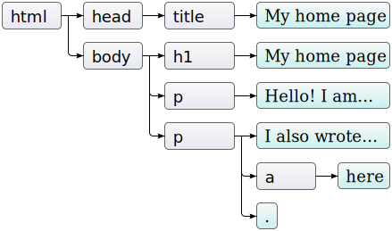

# JavaScript DOM 1

---

## Document Object Model (DOM)

The DOM is a programming interface for HTML, XHTML, and XML (Extensible Markup Language) documents.

It is a cross-platform and language-independent convention for representing and interacting with objects in the web page.

It represents the page so that programs can change the document structure, style, and content.

The DOM represents the document as _nodes_ and _objects_. That way, programming languages like JavaScript can connect to the page.

The nodes of every document are organized in a tree structure, called the DOM tree. Objects in the DOM tree may be addressed and manipulated by using methods on the objects. The public interface of a DOM is specified in its application programming interface (API).

---

## Representation

For example, these are the representation of the HTML:

```html
<!doctype html>
<html>
  <head>
    <title>My home page</title>
  </head>
  <body>
    <h1>My home page</h1>
    <p>Hello, I am Marijn and this is my home page.</p>
    <p>I also wrote a book! Read it
      <a href="http://eloquentjavascript.net">here</a>.</p>
  </body>
</html>
```

The page structure:


The DOM tree:



While the relationship or links between those nodes:


---

## DOM objects

There are various objects that already provided by default in the DOM.

### `window` object

### `document` object

---

## DOM functions

`onLoad`

`onDOMReady`

---

## DOM node selection

`getElementById`

`getElementsByClass`

---

## DOM node traversing

---

## DOM node manipulation

`innerHTML`

`value`

---

## Browser Object Model (BOM)

The BOM is a browser-specific convention referring to all the objects exposed by the web browser. Unlike the Document Object Model, there is no standard for implementation and no strict definition, so browser vendors are free to implement the BOM in any way they wish.

BOM consists of the objects like `navigator`, `history`, `screen`, `location`, etc which are children of `window`. BOM features actually overlaps with DOM. Because BOM doesn't have any standard, any browser can implement it as they like.

Sometimes called [Browser API](https://developer.mozilla.org/en-US/docs/Web/API/Using_the_Browser_API).

---

## References

* Guide
  * [The Document Object Model - Eloquent JavaScript](http://eloquentjavascript.net/14_dom.html)
  * [Introduction to the DOM - MDN](https://developer.mozilla.org/en-US/docs/Web/API/Document_Object_Model/Introduction)
  * [DOM Enlightenment - Exploring the relationship between JavaScript and the modern HTML DOM](http://domenlightenment.com)
  * [HTML/JS: Making webpages interactive - Khan Academy](https://www.khanacademy.org/computing/computer-programming/html-css-js)
* Documentation

  * http://devdocs.io/dom
