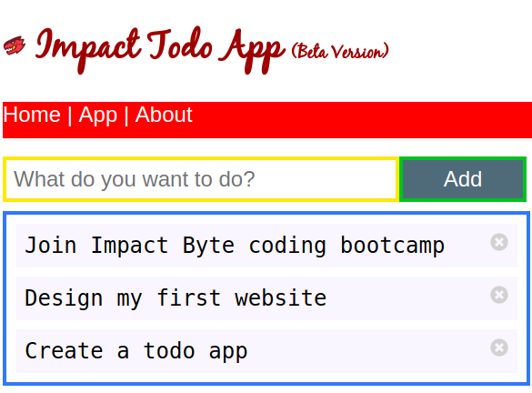
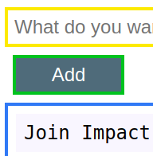
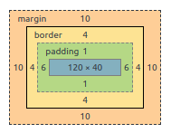

# CSS 1

---

## CSS (Cascading Style Sheet)

CSS is a way to style HTML page.

Usually have `.css` file extension.

It only structures the style, not the content or functionality.

That's why CSS can only works when we have HTML.



---

## HTML + CSS

There are three ways to use CSS into HTML.

### `style` HTML tag

HTML:

```html
<head>
  <title>Website</title>
  <style>
    /* CSS code here */
    selector {
      property: value;
    }
  </style>
</head>
```

### `link` HTML tag

HTML:

```html
<link rel="stylesheet" href="./index.css">
```

CSS:

```css
/* CSS code here */
selector {
  property: value;
}
```

### `@import` CSS declaration

CSS:

```css
@import url("./other.css");

/* CSS code here */
```

---

## CSS Identification/Class

A CSS declared like:

```css
selector {
  property: value;
}
```

or like

```css
who {
  what: how;
}
```

* who the element is
* what characteristic we want to change
* how the change is defined

Usually we choose an HTML element to be styled.

```css
h1 {
  color: blue;
}
```

We can also specify it further if there's an element inside an element.

```css
h1 span {
  color: darkblue;
}
```

We can have some comments in CSS as well:

```css
/* This is a CSS comment */
selector {
  property: value;
}
```

There's also a selector called pseudoclass like `:hover` and `:focus` to control the style when there's a particular condition with the HTML element.

```css
h1:hover {
  color: green;
}
```

To style the HTML with `id` and `class`, we use `#` symbol and a `.` (dot).

with `id`:

```html
<header id="title">
  App Title
</header>
```

```css
#title {
  font-size: 20px;
}
```

with `class`:

```html
<p class="gray">
  App description and story.
</p>
```

```css
.gray {
  color: gray;
}
```

---

## CSS Colors

Color in CSS can be in various format like its name, hex code, RGB, and HSL.

```css
.class {
  color: white;
  color: #ffffff;
  color: #fff;
  color: rgb(255, 255, 255)
  color: hsl(0, 0%, 100%);
}
```

---

## CSS Sizing

We can specify the `width` and `height` of the element dileberately.

```css
.class {
  width: 200px;
  height: 100px;
}
```

---

## CSS Box Model

### Properties

Every HTML elements can have a box model properties:

* `content`
* `padding`
* `border`
* `margin`

For example, this "Add" button:



has those properties and can be seen with Chrome Dev Tools when we're selecting it:



We can change them in CSS like so:

```css
.button {
  padding: 1px 6px;
  border: 4px solid green;
  margin: 10px;
}
```

### Display Layout

Commonly the default layout that is owned by an element is either `inline`, `inline-block`, or `block`, or other types.

* `block`: will take up the whole width available
* `inline`: will act as plain text, cant have a width or a height.
* `inline-block`: a combination of block and inline behavior, like inline elements but they can have a width and a height.

```css
selector {
  display: block;
}
```

### Position

Each element also can be positioned based on their position with other element or the whole web page.

**position**

* `absolute`
* `relative`
* `fixed`

**float**

* `float`: `left`, `right`, `top`, `bottom`

```css
selector {
  position: absolute;
  left: 0;
  bottom: 0;
}
```

```css
selector {
  float: left;
}
```

---

## CSS Style Guide

To assure our CSS quality, we can use a free tool called [csslint](http://csslint.net).

---

## References

* https://marksheet.io/css-basics.html
* https://learn.shayhowe.com/html-css/getting-to-know-css
* https://css-tricks.com
